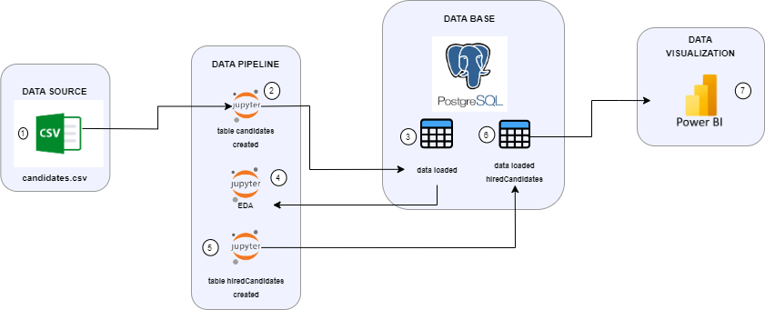

# Workshop_1: Python Data Engineer :chart_with_downwards_trend: :open_file_folder:
By: María de los Ángeles Amú Moreno :woman_technologist:

## Welcome
This Jupyter notebook offers solutions tailored to specific requirements, complemented by diagrams and visualizations. Through this workshop, users learn the implementation of SQLAlchemy as an ORM linked to PostgreSQL and the creation of visualizations using PowerBI.

The project entails receiving a CSV file containing details of candidates involved in selection processes. Notably, this dataset was generated randomly. The primary objective was to conduct analysis and manipulations on this dataset to extract pertinent insights, ultimately culminating in the visualization of the data of:

- Distribution of hires by technology (pie chart)
- Hires categorized by year (horizontal bar chart)
- Hires segmented by seniority (bar chart)
- Hires across years for select countries (USA, Brazil, Colombia, Ecuador) displayed through a multiline chart.

## Dataset Used
This dataset have 50k rows and 10 columns of data about candidates. The columns names of the dataset are:

1. First Name
2. Last Name
3. Email
4. Country 
5. Application Date 
6. Yoe (Years Of Experience) 
7. Seniority
8. Technology
9. Code Challenge Score
10. Technical Interview

## Flow Diagram

## Requirements
- Python
- SQLALchemy
- Psycopg2
- Pandas
- JSON credentials file (credentials.json)
  
## Tools Used

- Python 

- Pandas 

- Matplotlib

- PowerBI 

- SQLALchemy

- PostgreSQL 

- Jupyter Notebook

## Getting Started

1. Clone this repository:

        https://github.com/mdlangeles/Workshop_1.git

2. Create a virtual environment:
   
        python -m venv env

4. Activate said environment:
   
        env/scripts/activate

5. Install the Requirements:
   
        pip install -r requirements.txt
   
6.   Create a database in PostgreSQL:
   
   
   
   
   
7. Create the JSON file  with the next format:
   
        {
            "user": "your_user",
            "password": "your_password",
            "port": your_number_port,
            "server": "your_server_address",
            "db": "your_database_name"
        }

8. Explore the notebook: in [workshop1.ipynb](workshop1.ipynb) you can find all the workshop procedure, and enjoy it.
9. Go to PowerBI and once you have your table created in the database, you will be able to make the respective visualizations and interact with them:
    
    

10. You connect to PostgreSQL:
    

11. Select the "hiredCandidates" table created in notebook, and you can start with the required visualizations.
12. And now, remember that you can find the visualizations in [Visualizations - Workshop_1.pdf] in the repository archives.

## Thank you for visiting this Repository
I hope it has been helpful, and that you have enjoyed this interactive project.

I remain attentive to any questions, feedback or recommendations :blush:

 
